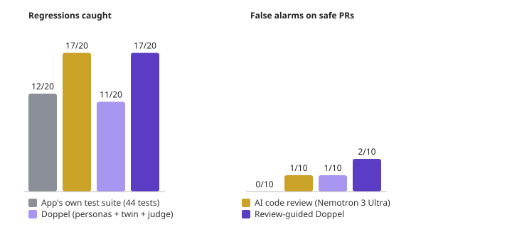

# Stage 5 benchmark: microblog-api

30 pull requests against [miguelgrinberg/microblog-api](https://github.com/miguelgrinberg/microblog-api) (20 with a regression, 10 safe). How the PRs were made and scored: [bench/README.md](../README.md).

| | Regressions caught | False alarms on safe PRs | Avg cost per PR | Avg time per PR |
|---|---|---|---|---|
| App's own test suite (44 tests) | **12/20** | 0/10 | $0 (CI minutes) | 11 s |
| AI code review (Nemotron 3 Ultra) | **17/20** | 1/10 | $0.028 | 3 s |
| Doppel (personas + twin + judge) | **11/20** | 1/10 | $0.128 | 81 s |
| Review-guided Doppel | **16/20** | 0/10 | $0.250 | 147 s |

**Tests + Review-guided Doppel: 20/20.** Caught by it and missed by the tests:

- `r02-revoke-auth`: Revoking without an Authorization header crashes with a 500 instead of 401.
- `r03-auth-error-field`: 401/403 responses rename the `message` field to `name`, unlike every other error.
- `r09-post-length`: Posts longer than 140 characters (allowed: 280) are rejected.
- `r11-email-length`: The email format check is gone: `not-an-email` is accepted.
- `r12-posts-url`: `posts_url` disappears from every user object.
- `r13-unfollow-all`: Unfollowing one user unfollows everyone.
- `r17-hash-leak`: Every user object now exposes the password hash.
- `r19-delete-missing`: Deleting a post that doesn't exist crashes with 500.

## Every PR

| PR | Kind | What it really does | Tests | AI review | Doppel | Guided |
|---|---|---|---|---|---|---|
| `r01-email-lookup` | regression | Duplicate emails now fail with a raw database integrity error instead of a validation error. *(reverted fix 5d704d1 (issue #9))* | ✅ | ✅ | ❌ | ✅ |
| `r02-revoke-auth` | regression | Revoking without an Authorization header crashes with a 500 instead of 401. *(reverted fix 4c5d5aa (issue #24))* | ❌ | ❌ | ❌ | ✅ |
| `r03-auth-error-field` | regression | 401/403 responses rename the `message` field to `name`, unlike every other error. *(reverted fix beed1d9)* | ❌ | ✅ | ❌ | ✅ |
| `r04-pagination-count` | regression | `pagination.total` is capped at the page size, so clients think there is one page. | ✅ | ✅ | ✅ | ✅ |
| `r05-feed-own-posts` | regression | Your own posts disappear from your feed. | ✅ | ✅ | ✅ | ✅ |
| `r06-password-change` | regression | The password can be changed without sending the old password. | ✅ | ✅ | ❌ | ✅ |
| `r07-edit-own-post` | regression | Authors get 403 when editing their own posts. | ✅ | ✅ | ✅ | ✅ |
| `r08-login-by-email` | regression | Logging in with an email address instead of a username stops working. | ✅ | ✅ | ❌ | ❌ |
| `r09-post-length` | regression | Posts longer than 140 characters (allowed: 280) are rejected. | ❌ | ✅ | ✅ | ✅ |
| `r10-post-201` | regression | Creating a post answers 200 instead of 201 Created. | ✅ | ✅ | ✅ | ✅ |
| `r11-email-length` | regression | The email format check is gone: `not-an-email` is accepted. | ❌ | ✅ | ✅ | ✅ |
| `r12-posts-url` | regression | `posts_url` disappears from every user object. | ❌ | ✅ | ✅ | ✅ |
| `r13-unfollow-all` | regression | Unfollowing one user unfollows everyone. | ❌ | ✅ | ✅ | ✅ |
| `r14-is-followed` | regression | `GET /me/following/<id>` answers whether they follow you, not you them. | ✅ | ✅ | ✅ | ❌ |
| `r15-followers-swapped` | regression | `/users/<id>/followers` returns who they follow. | ✅ | ✅ | ✅ | ✅ |
| `r16-user-posts-404` | regression | Unknown users get an empty list instead of 404. | ✅ | ✅ | ❌ | ✅ |
| `r17-hash-leak` | regression | Every user object now exposes the password hash. | ❌ | ❌ | ✅ | ✅ |
| `r18-after-cursor` | regression | `?after=` on newest-first lists returns the wrong page. | ✅ | ✅ | ❌ | ❌ |
| `r19-delete-missing` | regression | Deleting a post that doesn't exist crashes with 500. | ❌ | ✅ | ❌ | ✅ |
| `r20-page-size` | regression | The cap is removed entirely: `?limit=1000` returns everything. | ✅ | ❌ | ❌ | ❌ |
| `s01-rename-vars` | safe | (safe) | ✅ | ✅ | ✅ | ✅ |
| `s02-docstrings` | safe | (safe) | ✅ | ✅ | ✅ | ✅ |
| `s03-hide-others-posts` | safe | (safe) | ✅ | ✅ | ✅ | ✅ |
| `s04-no-self-follow` | safe | (safe) | ✅ | ✅ | ✅ | ✅ |
| `s05-posts-count` | safe | (safe) | ✅ | ✅ | ✅ | ✅ |
| `s06-longer-posts` | safe | (safe) | ✅ | ✅ | ✅ | ✅ |
| `s07-username-digits` | safe | (safe) | ✅ | ✅ | ⚠️ false alarm | ✅ |
| `s08-pagination-helper` | safe | (safe) | ✅ | ⚠️ false alarm | ✅ | ✅ |
| `s09-location` | safe | (safe) | ✅ | ✅ | ✅ | ✅ |
| `s10-user-stats` | safe | (safe) | ✅ | ✅ | ✅ | ✅ |

## Held-out set

10 more PRs written after the results above were in, and run once on the final version.

| | Regressions caught | False alarms on safe PRs |
|---|---|---|
| App's own test suite (44 tests) | **6/7** | 0/3 |
| AI code review (Nemotron 3 Ultra) | **5/7** | 0/3 |
| Doppel (personas + twin + judge) | not run | |
| Review-guided Doppel | **6/7** | 0/3 |

| PR | Kind | What it really does | Tests | AI review | Doppel | Guided |
|---|---|---|---|---|---|---|
| `h01-lookup-by-email` | regression | Lookup by username is gone: `/api/users/alice` answers 404. | ✅ | ✅ | · | ✅ |
| `h02-feed-order` | regression | The feed is oldest-first instead of newest-first. | ✅ | ❌ | · | ✅ |
| `h03-edit-not-saved` | regression | Edits answer 200 but are never saved: reading the post shows the old text. | ❌ | ❌ | · | ❌ |
| `h04-follow-twice` | regression | Following someone twice answers 204 instead of 409. | ✅ | ✅ | · | ✅ |
| `h05-about-me-required` | regression | Registering without `about_me` is now rejected with 400. | ✅ | ✅ | · | ✅ |
| `h06-token-lifetime` | regression | Access tokens expire immediately: every request after login answers 401. | ✅ | ✅ | · | ✅ |
| `h07-delete-check` | regression | Authors can't delete their posts, and anyone can delete everyone else's. | ✅ | ✅ | · | ✅ |
| `h08-rename-token-helper` | safe | (safe) | ✅ | ✅ | · | ✅ |
| `h09-feed-docs` | safe | (safe) | ✅ | ✅ | · | ✅ |
| `h10-shorter-usernames` | safe | (safe) | ✅ | ✅ | · | ✅ |

✅ right call · ❌ missed the regression · ⚠️ flagged a safe PR · · not run
